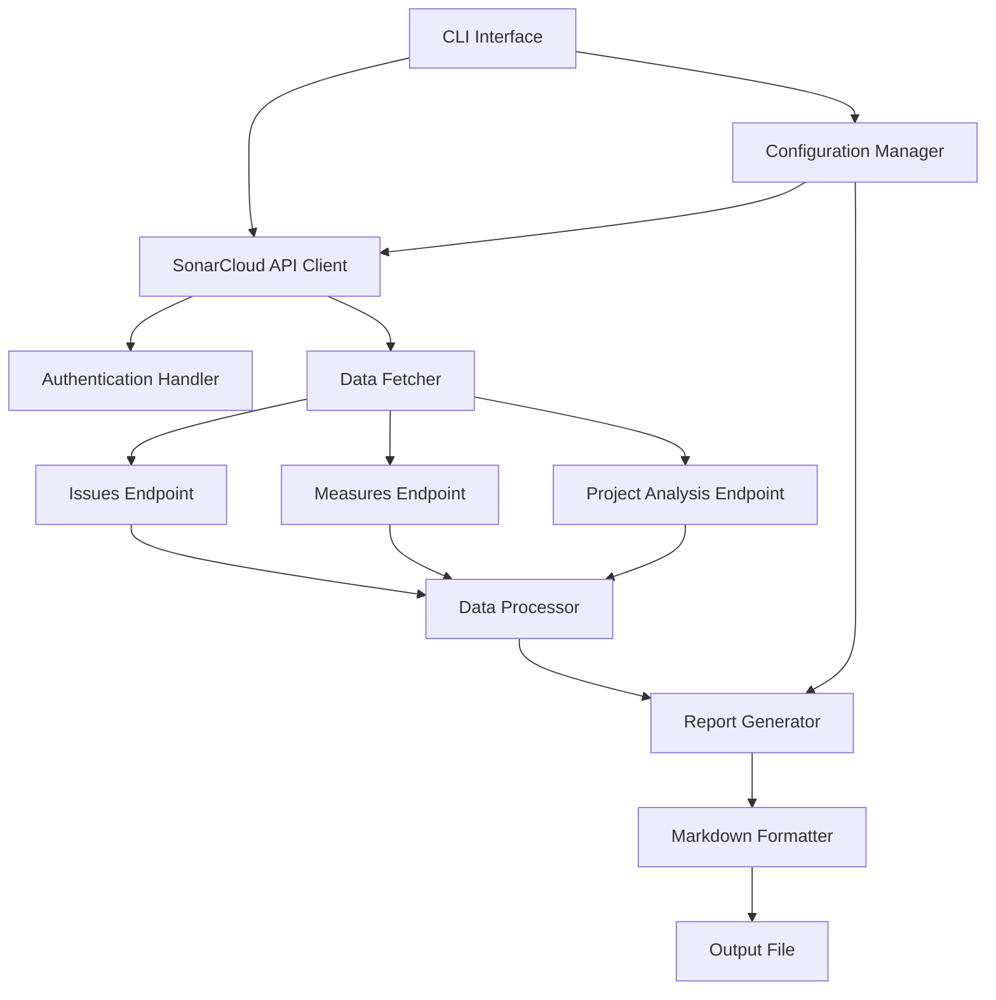

# SonarCloud SAST Report Generator - Architecture

## Overview

A Python-based tool to generate customer-facing SAST (Static Application Security Testing) reports from SonarCloud API data. The tool will fetch security vulnerabilities, code quality metrics, and other relevant data, then format it into a professional Markdown report.

## System Architecture



## Key Components

### 1. Configuration Manager
**Purpose**: Handle API credentials and project settings

**Responsibilities**:
- Load configuration from environment variables or config file
- Validate required settings (API token, organization, project key)
- Provide configuration to other components

**Configuration Format**:
```yaml
sonarcloud:
  token: "your-api-token"
  organization: "your-org"
  project_key: "your-project-key"
  base_url: "https://sonarcloud.io"

report:
  output_path: "./reports"
  include_resolved: false
  severity_filter: ["BLOCKER", "CRITICAL", "MAJOR"]
```

### 2. SonarCloud API Client
**Purpose**: Interface with SonarCloud REST API

**Key Endpoints to Use**:
- `/api/issues/search` - Fetch security vulnerabilities and code smells
- `/api/measures/component` - Get project metrics (coverage, duplications, etc.)
- `/api/project_analyses/search` - Get analysis history
- `/api/qualitygates/project_status` - Get quality gate status
- `/api/hotspots/search` - Get security hotspots

**Authentication**: Bearer token in Authorization header

### 3. Data Models

#### Issue Model
```python
class Issue:
    key: str
    type: str  # BUG, VULNERABILITY, CODE_SMELL, SECURITY_HOTSPOT
    severity: str  # BLOCKER, CRITICAL, MAJOR, MINOR, INFO
    status: str
    message: str
    component: str
    line: int
    creation_date: datetime
    tags: List[str]
```

#### Metric Model
```python
class Metric:
    key: str
    value: str
    metric_name: str
```

#### ProjectInfo Model
```python
class ProjectInfo:
    key: str
    name: str
    organization: str
    last_analysis_date: datetime
    quality_gate_status: str
```

### 4. Report Generator
**Purpose**: Transform API data into customer-friendly Markdown report

**Report Structure**:

```markdown
# SAST Report: [Project Name]

## Executive Summary
- Report Date
- Project Key
- Last Analysis Date
- Overall Quality Gate Status
- Total Issues by Severity

## Security Overview
### Critical Vulnerabilities
- Count and list
### High Severity Issues
- Count and list
### Security Hotspots
- Count and summary

## Code Quality Metrics
- Lines of Code
- Code Coverage
- Technical Debt
- Code Duplications
- Maintainability Rating
- Reliability Rating
- Security Rating

## Detailed Findings
### Vulnerabilities
[Table with severity, type, location, description]

### Bugs
[Table with severity, type, location, description]

### Code Smells (Top 10)
[Table with severity, type, location, description]

## Compliance & Standards
- OWASP Top 10 coverage
- CWE references
- SANS Top 25

## Recommendations
- Priority actions based on severity
- Technical debt reduction suggestions

## Appendix
- Methodology
- Severity Definitions
- Report Generation Details
```

## Technology Stack

### Core Dependencies
- **requests**: HTTP client for API calls
- **python-dotenv**: Environment variable management
- **pyyaml**: Configuration file parsing
- **jinja2**: Template engine for report generation
- **click**: CLI framework
- **tabulate**: Table formatting for Markdown

### Development Dependencies
- **pytest**: Testing framework
- **black**: Code formatting
- **mypy**: Type checking
- **pylint**: Code linting

## Project Structure

```
sonar-reports/
├── src/
│   ├── __init__.py
│   ├── cli.py                 # CLI entry point
│   ├── config.py              # Configuration management
│   ├── api/
│   │   ├── __init__.py
│   │   ├── client.py          # SonarCloud API client
│   │   └── endpoints.py       # API endpoint definitions
│   ├── models/
│   │   ├── __init__.py
│   │   ├── issue.py           # Issue data model
│   │   ├── metric.py          # Metric data model
│   │   └── project.py         # Project data model
│   ├── processors/
│   │   ├── __init__.py
│   │   └── data_processor.py  # Data transformation logic
│   └── report/
│       ├── __init__.py
│       ├── generator.py       # Report generation logic
│       └── templates/
│           └── report.md.j2   # Markdown template
├── tests/
│   ├── __init__.py
│   ├── test_api.py
│   ├── test_processor.py
│   └── test_generator.py
├── config/
│   ├── config.example.yaml
│   └── .env.example
├── reports/                   # Output directory
├── requirements.txt
├── setup.py
├── README.md
└── .gitignore
```

## Data Flow

1. **Input Phase**
   - User runs CLI command with project key
   - Configuration loaded from file/environment
   - API token validated

2. **Fetch Phase**
   - Authenticate with SonarCloud API
   - Fetch issues (vulnerabilities, bugs, code smells)
   - Fetch project metrics
   - Fetch quality gate status
   - Fetch security hotspots

3. **Process Phase**
   - Parse API responses into data models
   - Filter issues by severity/status
   - Calculate summary statistics
   - Group issues by type and severity
   - Sort by priority

4. **Generate Phase**
   - Load Markdown template
   - Populate template with processed data
   - Format tables and lists
   - Add metadata and timestamps
   - Write to output file

5. **Output Phase**
   - Save Markdown report to file
   - Display summary to console
   - Return success/failure status

## API Integration Details

### Authentication
```python
headers = {
    "Authorization": f"Bearer {api_token}",
    "Content-Type": "application/json"
}
```

### Key API Calls

#### Fetch Issues
```
GET /api/issues/search
Parameters:
  - componentKeys: project_key
  - types: VULNERABILITY,BUG,CODE_SMELL
  - statuses: OPEN,CONFIRMED,REOPENED
  - ps: 500 (page size)
  - p: 1 (page number)
```

#### Fetch Metrics
```
GET /api/measures/component
Parameters:
  - component: project_key
  - metricKeys: ncloc,coverage,duplicated_lines_density,
                sqale_index,reliability_rating,
                security_rating,vulnerabilities,bugs,
                code_smells
```

#### Fetch Security Hotspots
```
GET /api/hotspots/search
Parameters:
  - projectKey: project_key
  - status: TO_REVIEW,REVIEWED
  - ps: 500
```

## Error Handling Strategy

1. **API Errors**
   - Retry logic with exponential backoff
   - Clear error messages for authentication failures
   - Handle rate limiting (429 responses)

2. **Data Validation**
   - Validate API responses before processing
   - Handle missing or null fields gracefully
   - Log warnings for unexpected data

3. **Configuration Errors**
   - Validate required fields on startup
   - Provide helpful error messages
   - Exit gracefully with non-zero status

## Security Considerations

1. **API Token Storage**
   - Never commit tokens to version control
   - Use environment variables or secure config files
   - Add .env and config files to .gitignore

2. **Data Handling**
   - Don't log sensitive information
   - Sanitize file paths
   - Validate user inputs

## Performance Optimization

1. **Pagination**
   - Handle large result sets with pagination
   - Fetch data in batches

2. **Caching**
   - Optional: Cache API responses for development
   - Clear cache on new analysis

3. **Parallel Requests**
   - Fetch different endpoints concurrently
   - Use async/await for better performance

## CLI Interface Design

### Basic Usage
```bash
# Generate report for a project
sonar-report generate --project-key my-project

# With custom config file
sonar-report generate --project-key my-project --config config.yaml

# With output path
sonar-report generate --project-key my-project --output ./reports/report.md

# List available projects
sonar-report list-projects

# Validate configuration
sonar-report validate-config
```

### Command Options
- `--project-key`: SonarCloud project key (required)
- `--config`: Path to config file (optional)
- `--output`: Output file path (optional)
- `--format`: Report format - markdown/html (future)
- `--severity`: Filter by severity levels (optional)
- `--include-resolved`: Include resolved issues (optional)
- `--verbose`: Enable verbose logging (optional)

## Future Enhancements

1. **Multiple Output Formats**
   - HTML reports with charts
   - PDF generation
   - JSON export for automation

2. **Trend Analysis**
   - Compare with previous reports
   - Show improvement/degradation over time

3. **Custom Templates**
   - Allow users to customize report structure
   - Support multiple report templates

4. **Integration**
   - CI/CD pipeline integration
   - Webhook support
   - Email delivery

5. **Visualization**
   - Charts for metrics trends
   - Severity distribution graphs
   - Quality gate history

## Success Criteria

- Successfully authenticate with SonarCloud API
- Fetch all relevant data for a project
- Generate well-formatted Markdown report
- Include all customer-relevant information
- Handle errors gracefully
- Complete execution in under 30 seconds for typical projects
- Easy to configure and use