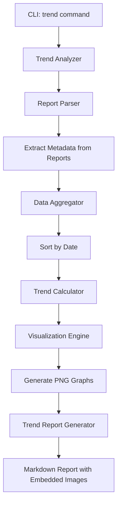

# Trend Graph Feature - Design Document

## Overview

This document outlines the design for adding trend graph capabilities to the SonarCloud SAST Report Generator. The feature will allow users to analyze multiple report files over time and generate visual trend graphs showing how metrics evolve.

## Goals

1. **Metadata Embedding**: Append structured metadata to each generated report for easy parsing
2. **Flexible Analysis**: Accept any `.md` report files from a specified directory
3. **Visual Trends**: Generate PNG graphs showing metric trends over time
4. **Markdown Output**: Create a trend report in Markdown format with embedded graph images
5. **Remove Technical Debt**: Eliminate technical debt metrics from reports (not needed)

## Architecture



## Component Design

### 1. Metadata Format

Each report will include a metadata section at the end in YAML format for easy parsing:

```yaml
---
# REPORT_METADATA
report_version: "1.0"
generated_date: "2025-12-04T08:49:50Z"
analysis_date: "2025-12-03T14:19:38Z"
project:
  key: "365projectum_PM.PowerHub"
  name: "PM.PowerHub"
  organization: "365projectum"
quality_gate:
  status: "ERROR"
  passed: false
metrics:
  total_issues: 402
  blocker_issues: 1
  critical_issues: 66
  major_issues: 335
  minor_issues: 0
  info_issues: 0
  security_issues: 2
  reliability_issues: 32
  maintainability_issues: 368
  vulnerabilities: 7
  bugs: 41
  code_smells: 354
  security_hotspots: 7
  code_coverage: 3.4
  reliability_rating: "C"
  security_rating: "E"
  maintainability_rating: "A"
categories:
  security:
    total: 2
    blocker: 1
    critical: 0
    major: 1
    minor: 0
    info: 0
  reliability:
    total: 32
    blocker: 0
    critical: 0
    major: 32
    minor: 0
    info: 0
  maintainability:
    total: 368
    blocker: 0
    critical: 66
    major: 302
    minor: 0
    info: 0
---
```

**Benefits:**
- Easy to parse with YAML libraries
- Human-readable
- Doesn't interfere with report rendering
- Can be extended without breaking existing parsers
- Clearly marked with `# REPORT_METADATA` comment

### 2. Report Parser Module

**File**: `src/sonar_reports/trend/parser.py`

```python
class ReportParser:
    """Parse metadata from markdown report files."""
    
    def parse_report(self, file_path: str) -> ReportMetadata:
        """Extract metadata from a report file."""
        
    def extract_metadata_block(self, content: str) -> dict:
        """Find and parse the YAML metadata block."""
        
    def validate_metadata(self, metadata: dict) -> bool:
        """Validate metadata structure."""
```

**Key Features:**
- Robust parsing that handles missing metadata gracefully
- Validation to ensure required fields are present
- Support for multiple report versions
- Error handling for corrupted files

### 3. Data Aggregator Module

**File**: `src/sonar_reports/trend/aggregator.py`

```python
class TrendDataAggregator:
    """Aggregate metrics from multiple reports."""
    
    def aggregate_reports(self, reports: List[ReportMetadata]) -> TrendData:
        """Combine data from multiple reports."""
        
    def sort_by_date(self, reports: List[ReportMetadata]) -> List[ReportMetadata]:
        """Sort reports chronologically."""
        
    def calculate_trends(self, trend_data: TrendData) -> TrendAnalysis:
        """Calculate trend statistics (improvements, regressions)."""
```

**Metrics to Track:**
- Total issues by severity (Blocker, Critical, Major, Minor, Info)
- Security issues count
- Reliability issues count
- Maintainability issues count
- Vulnerabilities count
- Bugs count
- Security hotspots count
- Code coverage percentage
- Quality ratings (Security, Reliability, Maintainability)
- Quality gate status (pass/fail over time)

### 4. Visualization Module

**File**: `src/sonar_reports/trend/visualizer.py`

```python
class TrendVisualizer:
    """Generate trend graphs using matplotlib."""
    
    def create_issues_trend_graph(self, data: TrendData, output_path: str):
        """Create graph showing issues by severity over time."""
        
    def create_security_trend_graph(self, data: TrendData, output_path: str):
        """Create graph showing security metrics over time."""
        
    def create_quality_gate_graph(self, data: TrendData, output_path: str):
        """Create graph showing quality gate status over time."""
        
    def create_coverage_trend_graph(self, data: TrendData, output_path: str):
        """Create graph showing code coverage over time."""
        
    def create_ratings_trend_graph(self, data: TrendData, output_path: str):
        """Create graph showing quality ratings over time."""
```

**Graph Types:**

1. **Issues by Severity Trend**
   - Line graph with multiple lines (Blocker, Critical, Major)
   - X-axis: Date
   - Y-axis: Issue count
   - Color-coded by severity

2. **Security Metrics Trend**
   - Stacked area chart showing:
     - Vulnerabilities
     - Security hotspots
     - Security issues
   - X-axis: Date
   - Y-axis: Count

3. **Quality Gate Status**
   - Bar chart showing pass/fail over time
   - Green for PASS, Red for ERROR
   - X-axis: Date
   - Y-axis: Status (binary)

4. **Code Coverage Trend**
   - Line graph showing coverage percentage
   - X-axis: Date
   - Y-axis: Coverage %
   - Target line at 80%

5. **Quality Ratings Trend**
   - Multi-line graph showing ratings (A=5, B=4, C=3, D=2, E=1)
   - Lines for Security, Reliability, Maintainability
   - X-axis: Date
   - Y-axis: Rating (1-5)

### 5. Trend Report Generator

**File**: `src/sonar_reports/trend/report_generator.py`

```python
class TrendReportGenerator:
    """Generate markdown trend reports with embedded graphs."""
    
    def generate(self, trend_data: TrendData, output_path: str):
        """Generate complete trend report."""
        
    def embed_graph_images(self, template: str, graph_paths: dict) -> str:
        """Embed graph images in markdown."""
```

**Report Structure:**

```markdown
# Trend Analysis Report: {Project Name}

**Analysis Period:** {Start Date} to {End Date}  
**Reports Analyzed:** {Count}  
**Generated:** {Timestamp}

---

## Executive Summary

- **Overall Trend:** {Improving/Declining/Stable}
- **Quality Gate:** {Pass Rate}%
- **Critical Issues:** {Change} ({+/-}X%)
- **Security Rating:** {Current} (was {Previous})

---

## Issues Trend


### Key Observations
- Blocker issues: {trend description}
- Critical issues: {trend description}
- Major issues: {trend description}

---

## Security Trend


### Key Observations
- Vulnerabilities: {trend description}
- Security hotspots: {trend description}

---

## Quality Gate History


### Statistics
- Pass rate: {X}%
- Current streak: {X} {passes/failures}

---

## Code Coverage Trend


### Key Observations
- Current coverage: {X}%
- Change from first report: {+/-}X%

---

## Quality Ratings Trend


### Current Ratings
- Security: {Rating}
- Reliability: {Rating}
- Maintainability: {Rating}

---

## Detailed Metrics Table

| Date | Quality Gate | Blocker | Critical | Major | Security | Coverage | Sec Rating | Rel Rating | Maint Rating |
|------|--------------|---------|----------|-------|----------|----------|------------|------------|--------------|
| ... | ... | ... | ... | ... | ... | ... | ... | ... | ... |

---

## Recommendations

Based on the trend analysis:

1. **{Priority}**: {Recommendation}
2. **{Priority}**: {Recommendation}
3. **{Priority}**: {Recommendation}
```

### 6. CLI Integration

**File**: `src/sonar_reports/cli.py` (add new command)

```python
@cli.command()
@click.option('--reports-dir', required=True, type=click.Path(exists=True),
              help='Directory containing report markdown files')
@click.option('--output', type=click.Path(),
              help='Output path for trend report (default: ./reports/trend-report.md)')
@click.option('--project-filter', help='Filter reports by project name/key')
@click.option('--graphs-dir', type=click.Path(),
              help='Directory to save graph images (default: ./reports/graphs/)')
@click.option('--format', type=click.Choice(['png', 'svg']), default='png',
              help='Graph image format')
def trend(reports_dir, output, project_filter, graphs_dir, format):
    """Generate trend analysis from multiple report files.
    
    Example:
        sonar-report trend --reports-dir ./reports --output ./reports/trend.md
    """
```

**Usage Examples:**

```bash
# Basic usage - analyze all reports in directory
python -m sonar_reports trend --reports-dir ./reports

# Filter by project
python -m sonar_reports trend --reports-dir ./reports --project-filter "PM.PowerHub"

# Custom output location
python -m sonar_reports trend --reports-dir ./reports --output ./trends/monthly-trend.md

# Custom graph directory
python -m sonar_reports trend --reports-dir ./reports --graphs-dir ./trends/graphs/
```

## Implementation Plan

### Phase 1: Metadata & Report Updates
1. ✅ Design metadata format (YAML block)
2. Update [`report.md.j2`](src/sonar_reports/report/templates/report.md.j2) template to include metadata section
3. Update [`generator.py`](src/sonar_reports/report/generator.py) to populate metadata
4. Remove technical debt references from template and generator

### Phase 2: Parsing & Aggregation
5. Create `src/sonar_reports/trend/` package
6. Implement `parser.py` - parse metadata from reports
7. Implement `aggregator.py` - aggregate and sort data
8. Create data models for trend analysis

### Phase 3: Visualization
9. Implement `visualizer.py` with matplotlib
10. Create graph generation functions for each metric type
11. Add styling and formatting for professional graphs
12. Test graph generation with sample data

### Phase 4: Report Generation
13. Create trend report template
14. Implement `report_generator.py` for trend reports
15. Add logic to embed graph images in markdown
16. Add trend analysis calculations (improvements/regressions)

### Phase 5: CLI & Integration
17. Add `trend` command to CLI
18. Add configuration options
19. Implement file discovery and filtering
20. Add error handling and validation

### Phase 6: Documentation & Testing
21. Update README with trend feature documentation
22. Create usage examples
23. Add unit tests for all modules
24. Create integration tests

## File Structure

```
src/sonar_reports/
├── trend/
│   ├── __init__.py
│   ├── parser.py           # Parse metadata from reports
│   ├── aggregator.py       # Aggregate data from multiple reports
│   ├── visualizer.py       # Generate graphs with matplotlib
│   ├── report_generator.py # Generate trend markdown reports
│   ├── models.py           # Data models for trend analysis
│   └── templates/
│       └── trend_report.md.j2  # Trend report template
├── report/
│   ├── generator.py        # Updated to include metadata
│   └── templates/
│       └── report.md.j2    # Updated template with metadata section
└── cli.py                  # Updated with trend command
```

## Dependencies

Add to `requirements.txt`:
```
matplotlib>=3.7.0
numpy>=1.24.0
pyyaml>=6.0
```

## Configuration Options

Add to config file:
```yaml
trend:
  graph_style: "seaborn"  # matplotlib style
  graph_dpi: 300          # image resolution
  graph_format: "png"     # png or svg
  date_format: "%Y-%m-%d" # date display format
  show_trend_lines: true  # add trend lines to graphs
  color_scheme:
    blocker: "#d32f2f"
    critical: "#f57c00"
    major: "#fbc02d"
    minor: "#7cb342"
    info: "#0288d1"
```

## Benefits

1. **No External Dependencies**: Works with local report files, no CDN needed
2. **Flexible**: Accepts any `.md` files with metadata
3. **Visual**: Clear graphs show trends at a glance
4. **Actionable**: Identifies improvements and regressions
5. **Portable**: Markdown reports with embedded images
6. **Extensible**: Easy to add new metrics and graph types

## Future Enhancements

1. **Interactive HTML Reports**: Add option for interactive charts with Plotly
2. **Comparison Mode**: Compare multiple projects side-by-side
3. **Alerts**: Detect significant regressions and highlight them
4. **Export Options**: Export data to CSV/JSON for further analysis
5. **Baseline Comparison**: Compare against a baseline report
6. **Custom Metrics**: Allow users to define custom metrics to track

## Questions for Review

1. ✅ Is the YAML metadata format acceptable?
2. ✅ Are the proposed graph types sufficient?
3. ✅ Should we support other graph formats (SVG, PDF)?
4. ✅ Any additional metrics to track?
5. ✅ Should we add interactive HTML reports as an option?

---

**Next Steps**: Review this design and provide feedback. Once approved, we can switch to Code mode to implement the solution.